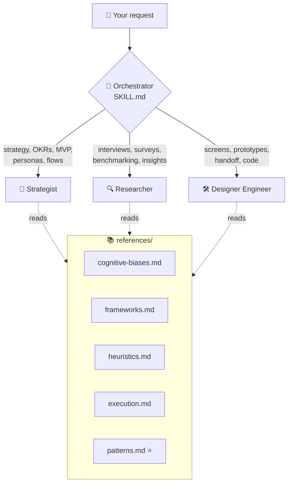
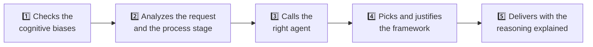
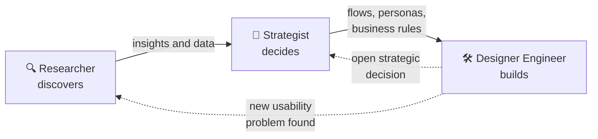
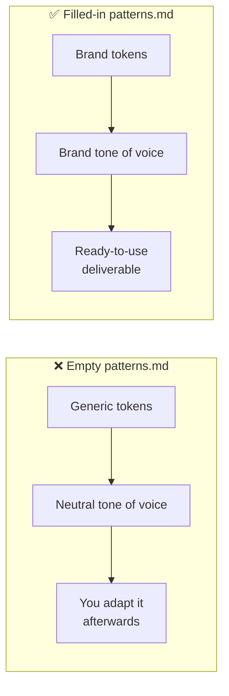

<div align="center">

# 🎨 Design Skill

**A full design team inside Claude: strategy, research and visual execution in a single skill.**

[](LICENSE)


[🇧🇷 Português](README.pt.md) · 🇺🇸 **English**

</div>

---

## 📑 Table of contents

1. [What the skill is](#-what-the-skill-is)
2. [What the skill does](#-what-the-skill-does)
3. [What it can do for you](#-what-it-can-do-for-you)
4. [Repository structure](#-repository-structure)
5. [Installation](#-installation)
6. [How to use it](#-how-to-use-it)
7. [Make the skill even more powerful](#-make-the-skill-even-more-powerful)
8. [Reference library](#-reference-library)
9. [License](#-license)

---

## 🧭 What the skill is

**Design Skill** is an **orchestrator skill** for Claude. It doesn't answer on its own: it **reads your request, works out which stage of the design process it belongs to and calls the right specialist agent** to do the work.

It has three parts:

| Layer | What it is | Count |
|---|---|:---:|
| 🧠 **Orchestrator** (`SKILL.md`) | Analyzes the request, picks the agent and applies the general rules | 1 |
| 👥 **Specialist agents** (`agents/`) | Each one has its own persona, responsibilities, frameworks and delivery format | 3 |
| 📚 **References** (`references/`) | Knowledge base the agents read before answering | 5 |



### 👥 The three agents

| Agent | Persona | Responsible for |
|---|---|---|
| 🎯 **Strategist** | Senior Service Designer | Product strategy, OKRs, prioritization, MVPs, information architecture, user flows, service blueprints, personas and business rules |
| 🔍 **Researcher** | Senior UX Researcher | Research plans, qualitative and quantitative research, usability testing, desk research, benchmarking, A/B tests, fakedoor tests and insight synthesis |
| 🛠️ **Designer Engineer** | A designer who also codes | Wireframes, high-fidelity interfaces, clickable prototypes, design systems, heuristic evaluation, developer handoff and front-end code |

### 🌎 Two versions, same content

| Version | Folder | Use it when |
|---|---|---|
| 🇺🇸 `design-en` | [`design-en/`](design-en) | The conversation or deliverable is in **English** |
| 🇧🇷 `design-pt` | [`design-pt/`](design-pt) | The conversation or deliverable is in **Portuguese** |

Both have the same agents, rules and references. Only the language changes.

---

## 🧩 What the skill does

You don't need to say "use the design skill". It **triggers on its own** whenever a request involves product, user experience, digital strategy or building interfaces.

For every request, it follows this path:



1. **Checks the cognitive biases.** Before any answer, it reads `cognitive-biases.md` and identifies which of the 18 biases and psychological laws affect the request.
2. **Analyzes the request.** It picks out keywords, project context and which stage of the process you're in.
3. **Calls the right agent** and tells you which one and why. If the request spans several areas, it tells you which agents will step in and in what order.
4. **Picks the framework** that best fits from `frameworks.md` and justifies the choice. Nothing is applied by default.
5. **Delivers with reasoning**: a detailed problem, the pain points, a solution per pain point and the reason behind each decision.

### 🔗 On a full project, the agents work as a chain



### 📏 Rules the skill always follows

| ✅ Always | ❌ Never |
|---|---|
| Says which agent was called and why | Drifts away from what was asked |
| Shows at least **2 options** when there's more than one path | Picks a path without showing alternatives |
| Says which cognitive biases it applied and why | Answers without checking the cognitive biases |
| Focuses on the real problem, not the quick fix | Interrogates you: at most **1 question** when the request is ambiguous |
| Runs an ethics and dark-pattern check before delivering | Uses biases in a manipulative way |

---

## 🚀 What it can do for you

### 1. 🔭 Kick off a discovery exploration

Sets up a project's discovery phase from scratch: what you know, what you assume and what still needs validating.

- **Agents:** Researcher + Strategist
- **Frameworks used:** Double Diamond (Discover phase), CSD Matrix, JTBD, desk research, benchmarking, qualitative research plan
- **You get:** a map of certainties, assumptions and doubts; a research plan with a justified methodology; next steps

> 💬 *"We're starting a personal finance app. Set up the discovery phase."*

### 2. 🎯 Find strategic proposals

Turns pain points and insights into product direction, with clear prioritization and a well-scoped MVP.

- **Agent:** Strategist
- **Frameworks used:** Opportunity Solution Tree, MoSCoW, Service Blueprint, flowcharts, JTBD
- **You get:** a detailed problem with its pain points, one solution per pain point, the framework applied and justified, and at least 2 paths to choose from

> 💬 *"Users drop off at step 3 of sign-up. What strategic paths do we have to fix it?"*

### 3. 📊 Create OKRs and KPIs

Defines goals and the metrics that prove whether the product is getting there, tied to user behavior.

- **Agents:** Strategist (OKRs and prioritization) + Researcher (metrics, data analysis, A/B tests)
- **Example metrics:** activation rate and time to activate, drop-off per step, D7/D30 retention, the primary metric of an A/B test, a fakedoor's click-through rate
- **You get:** clear objectives, measurable key results, and KPIs with the reasoning behind each one and how to measure it

> 💬 *"Create next quarter's OKRs for onboarding and the KPIs we'll track."*

### 4. 🖌️ Generate concise, on-brand designs

Builds screens, components and prototypes using **your brand's tokens, typography and tone of voice** (defined in `patterns.md`).

- **Agent:** Designer Engineer
- **References used:** `patterns.md`, `execution.md` (15 execution patterns), `heuristics.md` (Nielsen's 10 heuristics), `cognitive-biases.md`
- **You get:** exactly the level you asked for (see below), with every decision explained: bias applied, execution pattern, heuristic, design principle and brand pattern

| Level | What you get |
|---|---|
| ⬜ **Low fidelity** | Black, white and grey wireframe: structure and hierarchy |
| 🎨 **High fidelity** | Interface with colors, typography, components and states |
| 👆 **Clickable** | Prototype with the full flow, ready for usability testing |
| 📐 **Handoff-ready** | High fidelity + a spec for developers (sizes, tokens, states, breakpoints) |
| 💻 **Code** | A working implementation in the chosen stack |

> 💬 *"Design the app's login screen in high fidelity following our brand patterns."*

---

## 📁 Repository structure

```
design-skill/
├── 📄 README.md                    ← landing page (language picker)
├── 📄 README.en.md                 ← you are here
├── 📄 README.pt.md                 ← Portuguese version
├── 📄 LICENSE                      ← MIT
├── 📂 .github/                     ← GitHub settings: SECURITY.md, CODEOWNERS and workflows
│
├── 📂 design-en/                   ← full skill content in English
│   ├── SKILL.md                    ← orchestrator
│   ├── agents/
│   │   ├── strategist.md           ← strategy, OKRs, MVPs, personas, flows
│   │   ├── researcher.md           ← research, benchmarking, insights
│   │   └── designer-engineer.md    ← UI, prototypes, heuristics, handoff, code
│   └── references/
│       ├── cognitive-biases.md     ← 18 cognitive biases and psychological laws
│       ├── frameworks.md           ← 22 frameworks and tools
│       ├── heuristics.md           ← Nielsen's 10 heuristics
│       ├── execution.md            ← 15 interface execution patterns
│       └── patterns.md             ← ⭐ template for YOUR brand's patterns
│
└── 📂 design-pt/                   ← same structure, in Portuguese
```

> 💡 **What about the `.skill` files?** They're the `design-en/` and `design-pt/` folders zipped, in the format Claude.ai accepts. They don't live in the repository: they're built automatically from the folders and published on the **[Releases](https://github.com/guilhermedworakowski/design-skill/releases)** page for every new version. That keeps the folders as the single source of truth.

---

## 📦 Installation

### Step 0: pick a version

- You talk in English → **`design-en`**
- You talk in Portuguese → **`design-pt`**
- You work in both → install **both**. Each one triggers based on the conversation's language.

### Option A: Claude.ai or Claude Desktop

1. Download **[`design-en.skill`](https://github.com/guilhermedworakowski/design-skill/releases/latest/download/design-en.skill)** or **[`design-pt.skill`](https://github.com/guilhermedworakowski/design-skill/releases/latest/download/design-pt.skill)**. The links always download the latest version.
2. In Claude, go to **Settings → Capabilities** and make sure **Code execution and file creation** is turned on. Skills need it.
3. Go to **Customize → Skills**, click **+**, then **Create skill** and **Upload a skill**. Pick the file you downloaded.
4. Check that the skill shows up in the list and is turned on.

> ℹ️ Steps follow the [Claude Help Center](https://support.claude.com/en/articles/12512180-use-skills-in-claude).
>
> - **Plans:** skills work on every plan, including Free. On Team and Enterprise, an admin needs to enable skills for the organization.
> - **File rejected?** If Claude doesn't accept the `.skill`, rename it to `.zip`. It's the same file.
> - **On the [Releases](https://github.com/guilhermedworakowski/design-skill/releases) page:** download the `.skill`. The "Source code" files are the whole repository, not the skill.

### Option B: Claude Code

Clone the repository:

```bash
git clone https://github.com/guilhermedworakowski/design-skill.git
```

Copy the skill into your personal skills folder (works across all projects):

```bash
mkdir -p ~/.claude/skills && cp -R design-skill/design-en ~/.claude/skills/
```

Or, to use it in a single project only, copy it into that project's `.claude/skills/`:

```bash
mkdir -p .claude/skills && cp -R design-skill/design-en .claude/skills/
```

> Swap `design-en` for `design-pt` for the Portuguese version, or run the command twice to install both.

### ✅ Test the installation

Open a new conversation and send:

> 💬 *"I want to set up discovery for a food delivery app."*

If it's working, Claude tells you which agent it called (here, the **Strategist** and/or the **Researcher**), names the cognitive biases it considered and justifies the framework it chose. In Claude Code you can also call the skill directly with `/design-en` or `/design-pt`.

---

## 💬 How to use it

Just write normally. The skill figures out the agent on its own.

| You write... | Who answers |
|---|---|
| *"Prioritize these 12 features for the MVP"* | 🎯 Strategist |
| *"Put together an interview guide for users who cancelled their subscription"* | 🔍 Researcher |
| *"Run a heuristic evaluation of this screen"* (attach the screenshot) | 🛠️ Designer Engineer |
| *"Research competitors, define the strategy and design the onboarding"* | 🔍 → 🎯 → 🛠️ all three, in a chain |

**Tips for better answers:**

- 🎛️ **Want a specific agent?** Say: *"using the Researcher, ..."* or *"call the Strategist to ..."*.
- 📎 **Give context:** project stage, audience, time constraints and what you already know. More context means fewer questions.
- 🎚️ **State the delivery level** for design work: low fidelity, high fidelity, clickable, handoff or code.

---

## 💪 Make the skill even more powerful

### ⭐ Fill in `patterns.md` with your brand's patterns

With an empty `patterns.md`, the skill still works well, but it uses generic tokens (e.g. `color-action-primary`, `spacing-md`) and **flags which patterns still need defining**. Once it's filled in, **every screen, flow and piece of copy comes out looking and sounding like your brand**, because the agents treat this file as the source of truth.



### 📝 What to fill in

Open [`design-en/references/patterns.md`](design-en/references/patterns.md) and replace everything in `[brackets]`:

| # | Section | What to add |
|:---:|---|---|
| 1 | 🎨 **Color palette** | Tokens, hex values and usage for primary, secondary, feedback and neutral colors |
| 2 | 🔤 **Typography** | Font family, fallback and headline, paragraph and caption styles (weight, size, line height) |
| 3 | ⬛ **Border radius** | Radius tokens and where each one is used |
| 4 | 📏 **Spacing** | Scale (4px or 8px) and tokens for padding, margin and gap |
| 5 | 📐 **Grid** | Width, columns, margin and gutter for each breakpoint |
| 6 | ✳️ **Iconography** | Library, allowed sizes and style (outlined, filled, rounded) |
| 7 | 🗣️ **Tone of voice** | Brand pillars, writing guidelines, do/don't examples, rules for errors, onboarding and empty states |

> 💡 You can delete sections that don't apply to your product, and add as many table rows as you need.

### 🏢 Add your company's business rules too

This is the step that makes the biggest difference. Add a new section at the end of `patterns.md` with the rules the product must respect. That way the Strategist designs flows that are actually possible, and the Designer Engineer doesn't create screens your company can't approve.

Example:

```markdown
## 8. Business Rules

| Rule | Description | Where it applies |
|---|---|---|
| Minimum age | Sign-up only for users aged 18 and over | Onboarding, sign-up form |
| Installments | Purchases over $500 can be split into up to 10 interest-free payments | Checkout, product page |
| Cancellation | Users can cancel their subscription in 2 clicks, with no forced retention | Account settings |
| Sensitive data | Tax IDs are never shown in full on screen (format ***-**-1234) | Profile, receipts |
```

Other sections worth adding as the product grows: **Components**, **Interaction patterns** and **Visual business rules**.

### 🔄 After editing, update the skill

**In Claude Code:** edit the file directly at `~/.claude/skills/design-en/references/patterns.md`. It applies from the next conversation.

**In Claude.ai or Claude Desktop:** build a new package and upload it again.

```bash
cd design-skill && zip -r design-en.skill design-en
```

Then, in **Settings → Capabilities → Skills**, remove the old version and upload the new `design-en.skill`.

> 🔒 **Confidential patterns? Don't publish your filled-in `patterns.md`.** On GitHub, a fork of a public repository is **always public**. Keep the edited file on your computer only, or make a private copy: click **Use this template → Create a new repository** at the top of this repository and pick **Private**. The copy is independent, and no one outside can see what you fill in.

---

## 📚 Reference library

<details>
<summary><b>🧠 cognitive-biases.md: 18 cognitive biases and psychological laws</b></summary>

<br/>

Required reading before every answer. Each agent owns a set of biases.

| Agent | Main biases |
|---|---|
| 🔍 Researcher | Confirmation Bias · Jakob's Law · Peak-End Rule · Framing Effect · Social Proof |
| 🎯 Strategist | Habit Loop · Goal Gradient · VRR · Scarcity · Loss Aversion · Decoy Effect · Anchoring |
| 🛠️ Designer Engineer | Anchoring · Von Restorff · Zeigarnik · Fitts's Law · Hick's Law · Miller's Law · Serial Position · Framing (copy) |

Includes an **ethics note** (persuasion vs. manipulation), a list of dark patterns to avoid and a **designer checklist** to run before shipping any feature that uses biases.

</details>

<details>
<summary><b>🧰 frameworks.md: 22 frameworks and tools</b></summary>

<br/>

| Strategy (Strategist) | Research (Researcher) | Execution (Designer Engineer) |
|---|---|---|
| CSD Matrix | Qualitative research | Figma |
| MoSCoW | Quantitative research | Storybook |
| Service Blueprint | Usability testing | Radix UI / Headless UI |
| Flowcharts | Desk research | Tailwind CSS |
| Double Diamond | Benchmarking | Framer Motion |
| Opportunity Solution Tree | A/B testing | React and Next.js |
| Jobs to Be Done | Fakedoor test | Svelte |
| | | Git and GitHub |

</details>

<details>
<summary><b>🔎 heuristics.md: Nielsen's 10 heuristics</b></summary>

<br/>

H1 Visibility of system status · H2 Match between the system and the real world · H3 User control and freedom · H4 Consistency and standards · H5 Error prevention · H6 Recognition rather than recall · H7 Flexibility and efficiency of use · H8 Aesthetic and minimalist design · H9 Help users recognize, diagnose and recover from errors · H10 Help and documentation

Includes a step-by-step guide to running a heuristic evaluation.

</details>

<details>
<summary><b>🛠️ execution.md: 15 interface execution patterns</b></summary>

<br/>

1. Interface states · 2. Response time and loading · 3. Feedback and confirmation · 4. Errors · 5. Forms · 6. Navigation · 7. Search · 8. Onboarding and empty states · 9. Motion, micro-interactions and gestures · 10. Visual hierarchy and composition · 11. Layout, grid, responsive and dark mode · 12. UX writing · 13. Components and tokens · 14. Handoff and QA · 15. Screen critique

Includes a **bias → pattern bridge** that links each cognitive bias to the interface pattern that puts it into practice.

</details>

<details>
<summary><b>⭐ patterns.md: your brand's patterns</b></summary>

<br/>

A template for you to fill in. See [Make the skill even more powerful](#-make-the-skill-even-more-powerful).

</details>

---

## 🤝 Contributing

Suggestions, fixes and new frameworks are welcome. Open an **issue** or send a **pull request**. If you change one version's content, remember to mirror the change in the other (`design-en` ↔ `design-pt`).

**Commit format:** use [Conventional Commits](https://www.conventionalcommits.org/) as `type(scope): description`, for both commits and the PR title.

| Type | When to use it | Example |
|---|---|---|
| `feat` | A new skill capability | `feat(strategist): add North Star Metric framework` |
| `fix` | A content or behavior fix | `fix(researcher): fix the clarifying-question limit` |
| `docs` | Documentation only (READMEs, SECURITY) | `docs(readme): detail the Claude Code install` |
| `ci` | GitHub Actions workflows | `ci(release): generate package checksums` |
| `chore` | Maintenance that doesn't change the skill | `chore: update CODEOWNERS` |
| `refactor` | Reorganizes without changing behavior | `refactor(references): split frameworks.md by agent` |

> ⚠️ **Don't add `.skill` or `.zip` files to your PR.** Only change the `design-en/` and `design-pt/` folders, always both. An automated check rejects committed packages and confirms both versions have the same files.

**Publishing a new version (maintainer):** after merging into `main`, create a tag following [semantic versioning](https://semver.org/). Use `fix` to bump the last number (`v1.0.1`) and `feat` to bump the middle one (`v1.1.0`). The workflow builds the `.skill` files and `SHA256SUMS.txt` and publishes the Release on its own.

```bash
git tag v1.1.0 && git push origin v1.1.0
```

---

## 🔒 Security

Found something suspicious, like instructions that make Claude act against the user or a Release `.skill` that differs from its folder? **Don't open a public issue.** Report it privately, as explained in [SECURITY.md](.github/SECURITY.md).

---

## 📄 License

Released under the **MIT** license. Use it, adapt it and share it freely. See the [LICENSE](LICENSE) file.

<div align="center">
<br/>
Made by <a href="https://github.com/guilhermedworakowski">Guilherme Domingues</a>
</div>
