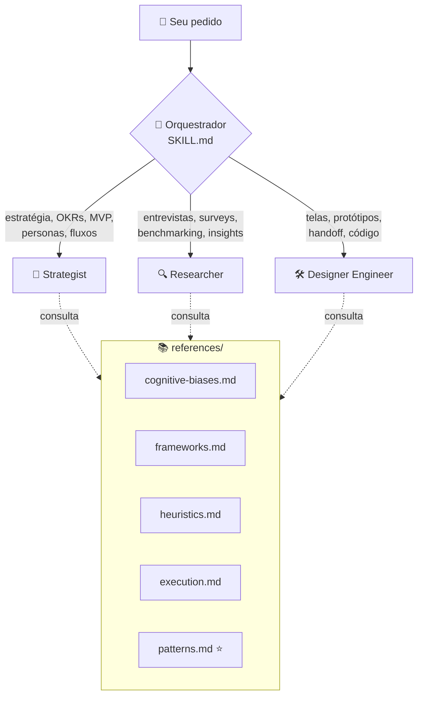
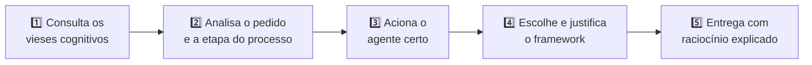
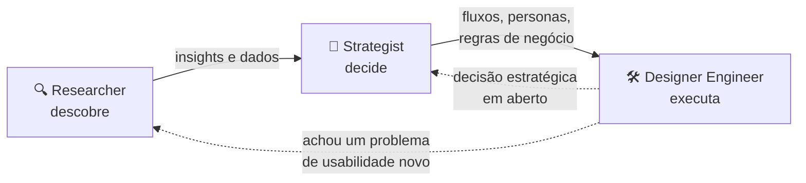
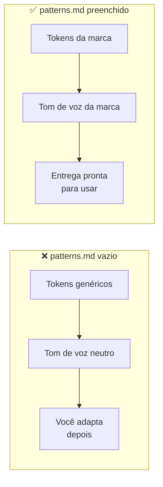

<div align="center">

# 🎨 Design Skill

**Um time de design completo dentro do Claude: estratégia, pesquisa e execução visual em uma única skill.**

[](LICENSE)


🇧🇷 **Português** · [🇺🇸 English](README.en.md)

</div>

---

## 📑 Sumário

1. [O que é a skill](#-o-que-é-a-skill)
2. [O que a skill faz](#-o-que-a-skill-faz)
3. [Do que ela é capaz](#-do-que-ela-é-capaz)
4. [Estrutura do repositório](#-estrutura-do-repositório)
5. [Instalação](#-instalação)
6. [Como usar](#-como-usar)
7. [Deixe a skill ainda mais poderosa](#-deixe-a-skill-ainda-mais-poderosa)
8. [Biblioteca de referências](#-biblioteca-de-referências)
9. [Licença](#-licença)

---

## 🧭 O que é a skill

A **Design Skill** é uma **skill orquestradora** para o Claude. Ela não responde sozinha: ela **lê o seu pedido, identifica em qual etapa do processo de design ele está e aciona o agente especialista certo** para fazer o trabalho.

Ela tem três partes:

| Camada | O que é | Quantidade |
|---|---|:---:|
| 🧠 **Orquestrador** (`SKILL.md`) | Analisa o pedido, escolhe o agente e aplica as regras gerais | 1 |
| 👥 **Agentes especialistas** (`agents/`) | Cada um tem persona, responsabilidades, frameworks e formato de entrega próprios | 3 |
| 📚 **Referências** (`references/`) | Base de conhecimento que os agentes consultam antes de responder | 5 |



### 👥 Os três agentes

| Agente | Persona | Responsável por |
|---|---|---|
| 🎯 **Strategist** | Service Designer sênior | Estratégia de produto, OKRs, priorização, MVPs, arquitetura de informação, user flows, service blueprints, personas e regras de negócio |
| 🔍 **Researcher** | UX Researcher sênior | Planos de pesquisa, pesquisas qualitativas e quantitativas, testes de usabilidade, desk research, benchmarking, testes A/B, fakedoor tests e síntese de insights |
| 🛠️ **Designer Engineer** | Designer que também programa | Wireframes, interfaces de alta fidelidade, protótipos navegáveis, design system, avaliação heurística, handoff para dev e código front-end |

### 🌎 Duas versões, mesmo conteúdo

| Versão | Pasta | Use quando |
|---|---|---|
| 🇧🇷 `design-pt` | [`design-pt/`](design-pt) | A conversa ou a entrega for em **português** |
| 🇺🇸 `design-en` | [`design-en/`](design-en) | A conversa ou a entrega for em **inglês** |

As duas têm os mesmos agentes, regras e referências. Só muda o idioma.

---

## 🧩 O que a skill faz

Você não precisa dizer "use a skill de design". Ela **aciona sozinha** sempre que o pedido envolve produto, experiência do usuário, estratégia digital ou construção de interfaces.

A cada pedido, ela segue este caminho:



1. **Consulta os vieses cognitivos.** Antes de qualquer resposta, lê `cognitive-biases.md` e identifica quais dos 18 vieses e leis psicológicas afetam aquela demanda.
2. **Analisa o pedido.** Identifica palavras-chave, contexto do projeto e em que etapa do processo você está.
3. **Aciona o agente certo** e diz qual é e por quê. Se o pedido cruza áreas, avisa quais agentes entram e em que ordem.
4. **Escolhe o framework** mais adequado em `frameworks.md` e justifica a escolha. Nada é aplicado por padrão.
5. **Entrega com raciocínio**: problema detalhado, dores, solução por dor e o porquê de cada decisão.

### 🔗 Quando o projeto é completo, os agentes trabalham em cadeia



### 📏 Regras que a skill sempre segue

| ✅ Sempre | ❌ Nunca |
|---|---|
| Diz qual agente foi acionado e por quê | Sai do assunto pedido |
| Mostra pelo menos **2 opções** quando há mais de um caminho | Escolhe um caminho sem mostrar alternativas |
| Diz quais vieses cognitivos aplicou e por quê | Responde sem consultar os vieses cognitivos |
| Foca no problema real, não na solução imediata | Faz um interrogatório: no máximo **1 pergunta** quando o pedido é ambíguo |
| Checa ética e dark patterns antes de entregar | Usa vieses de forma manipulativa |

---

## 🚀 Do que ela é capaz

### 1. 🔭 Começar uma exploração de discovery

Estrutura a fase de descoberta de um projeto do zero: o que se sabe, o que se supõe e o que precisa ser validado.

- **Agentes:** Researcher + Strategist
- **Frameworks usados:** Double Diamond (fase Discover), Matriz CSD, JTBD, desk research, benchmarking, plano de pesquisa qualitativa
- **Você recebe:** mapa de certezas, suposições e dúvidas; plano de pesquisa com metodologia justificada; próximos passos

> 💬 *"Estamos começando um app de finanças pessoais. Estruture a fase de discovery."*

### 2. 🎯 Encontrar propostas estratégicas

Transforma dores e insights em direção de produto, com priorização clara e um MVP bem recortado.

- **Agente:** Strategist
- **Frameworks usados:** Opportunity Solution Tree, MoSCoW, Service Blueprint, fluxogramas, JTBD
- **Você recebe:** problema detalhado com as dores, uma solução por dor, framework aplicado e justificado, pelo menos 2 caminhos para escolher

> 💬 *"Os usuários abandonam o cadastro no passo 3. Quais caminhos estratégicos temos para resolver?"*

### 3. 📊 Criar OKRs e KPIs

Define objetivos e as métricas que provam se o produto está chegando lá, conectadas ao comportamento do usuário.

- **Agentes:** Strategist (OKRs e priorização) + Researcher (métricas, análise de dados, testes A/B)
- **Exemplos de métricas:** taxa e tempo de ativação, abandono por etapa, retenção D7/D30, métrica primária de um teste A/B, taxa de clique de um fakedoor
- **Você recebe:** objetivos claros, resultados-chave mensuráveis, KPIs com a lógica por trás de cada um e como medi-los

> 💬 *"Crie os OKRs do próximo trimestre para o onboarding e os KPIs que vamos acompanhar."*

### 4. 🖌️ Gerar designs concisos e fiéis à marca

Constrói telas, componentes e protótipos usando os **tokens, a tipografia e o tom de voz da sua marca** (definidos em `patterns.md`).

- **Agente:** Designer Engineer
- **Referências usadas:** `patterns.md`, `execution.md` (15 padrões de execução), `heuristics.md` (10 heurísticas de Nielsen), `cognitive-biases.md`
- **Você recebe:** exatamente o nível pedido (veja abaixo), com cada decisão explicada: viés aplicado, padrão de execução, heurística, princípio de design e padrão da marca

| Nível | O que vem |
|---|---|
| ⬜ **Baixa fidelidade** | Wireframe em preto, branco e cinza: estrutura e hierarquia |
| 🎨 **Alta fidelidade** | Interface com cores, tipografia, componentes e estados |
| 👆 **Navegável** | Protótipo com fluxo completo, pronto para teste de usabilidade |
| 📐 **Pronto para handoff** | Alta fidelidade + especificação para devs (medidas, tokens, estados, breakpoints) |
| 💻 **Código** | Implementação funcional na stack definida |

> 💬 *"Crie em alta fidelidade a tela de login do app seguindo os padrões da marca."*

---

## 📁 Estrutura do repositório

```
design-skill/
├── 📄 README.md                    ← página inicial (escolha de idioma)
├── 📄 README.pt.md                 ← você está aqui
├── 📄 README.en.md                 ← versão em inglês
├── 📄 LICENSE                      ← MIT
├── 📂 .github/                     ← configurações do GitHub: SECURITY.md, CODEOWNERS e workflows
│
├── 📂 design-pt/                   ← conteúdo completo da skill em português
│   ├── SKILL.md                    ← orquestrador
│   ├── agents/
│   │   ├── strategist.md           ← estratégia, OKRs, MVPs, personas, fluxos
│   │   ├── researcher.md           ← pesquisas, benchmarking, insights
│   │   └── designer-engineer.md    ← UI, protótipos, heurísticas, handoff, código
│   └── references/
│       ├── cognitive-biases.md     ← 18 vieses cognitivos e leis psicológicas
│       ├── frameworks.md           ← 22 frameworks e ferramentas
│       ├── heuristics.md           ← 10 heurísticas de Nielsen
│       ├── execution.md            ← 15 padrões de execução de interface
│       └── patterns.md             ← ⭐ modelo para os padrões da SUA marca
│
└── 📂 design-en/                   ← mesma estrutura, em inglês
```

> 💡 **E os arquivos `.skill`?** São as pastas `design-pt/` e `design-en/` compactadas em `.zip`, no formato que o Claude.ai aceita. Eles não ficam no repositório: são gerados automaticamente a partir das pastas e publicados na página de **[Releases](https://github.com/guilhermedworakowski/design-skill/releases)** a cada nova versão. Assim as pastas são a única fonte da verdade.

---

## 📦 Instalação

### Passo 0: escolha a versão

- Conversa em português → **`design-pt`**
- Conversa em inglês → **`design-en`**
- Trabalha nos dois idiomas → instale **as duas**. Cada uma aciona conforme o idioma da conversa.

### Opção A: Claude.ai ou Claude Desktop

1. Baixe **[`design-pt.skill`](https://github.com/guilhermedworakowski/design-skill/releases/latest/download/design-pt.skill)** ou **[`design-en.skill`](https://github.com/guilhermedworakowski/design-skill/releases/latest/download/design-en.skill)**. Os links sempre baixam a versão mais recente.
2. No Claude, vá em **Configurações → Capacidades** (*Settings → Capabilities*) e confirme que **Execução de código e criação de arquivos** (*Code execution and file creation*) está ativada. As skills precisam disso.
3. Vá em **Personalizar → Skills** (*Customize → Skills*), clique no **+**, depois em **Criar skill** (*Create skill*) e em **Carregar uma skill** (*Upload a skill*). Selecione o arquivo que você baixou.
4. Confirme que a skill aparece na lista e está ativada.

> ℹ️ Os nomes entre parênteses são os da interface em inglês, conforme a [central de ajuda do Claude](https://support.claude.com/en/articles/12512180-use-skills-in-claude). Na tradução para o português, eles podem variar um pouco.
>
> - **Planos:** skills funcionam em todos os planos, inclusive no gratuito. Nos planos Team e Enterprise, um administrador precisa liberar as skills para a organização.
> - **Arquivo recusado?** Se o Claude não aceitar o `.skill`, renomeie para `.zip`. É o mesmo arquivo.
> - **Na página de [Releases](https://github.com/guilhermedworakowski/design-skill/releases):** baixe o `.skill`. Os arquivos "Source code" são o repositório inteiro, não a skill.

### Opção B: Claude Code

Clone o repositório:

```bash
git clone https://github.com/guilhermedworakowski/design-skill.git
```

Copie a skill para a sua pasta pessoal de skills (vale para todos os projetos):

```bash
mkdir -p ~/.claude/skills && cp -R design-skill/design-pt ~/.claude/skills/
```

Ou, para usar só em um projeto, copie para dentro dele em `.claude/skills/`:

```bash
mkdir -p .claude/skills && cp -R design-skill/design-pt .claude/skills/
```

> Troque `design-pt` por `design-en` para a versão em inglês, ou repita o comando para instalar as duas.

### ✅ Teste a instalação

Abra uma conversa nova e mande:

> 💬 *"Quero estruturar o discovery de um app de delivery."*

Se estiver funcionando, o Claude diz qual agente acionou (aqui, o **Strategist** e/ou o **Researcher**), cita os vieses cognitivos considerados e justifica o framework escolhido. No Claude Code você também pode chamar a skill direto com `/design-pt` ou `/design-en`.

---

## 💬 Como usar

Escreva normalmente. A skill identifica o agente sozinha.

| Você escreve... | Quem responde |
|---|---|
| *"Priorize estas 12 funcionalidades para o MVP"* | 🎯 Strategist |
| *"Monte um roteiro de entrevista com usuários que cancelaram a assinatura"* | 🔍 Researcher |
| *"Faça uma avaliação heurística desta tela"* (anexe o print) | 🛠️ Designer Engineer |
| *"Pesquise concorrentes, defina a estratégia e desenhe o onboarding"* | 🔍 → 🎯 → 🛠️ os três, em cadeia |

**Dicas para respostas melhores:**

- 🎛️ **Quer um agente específico?** Diga: *"usando o Researcher, ..."* ou *"acione o Strategist para ..."*.
- 📎 **Dê contexto:** fase do projeto, público, restrições de prazo e o que já se sabe. Quanto mais contexto, menos perguntas.
- 🎚️ **Diga o nível de entrega** no caso de design: baixa fidelidade, alta fidelidade, navegável, handoff ou código.

---

## 💪 Deixe a skill ainda mais poderosa

### ⭐ Preencha o `patterns.md` com os padrões da sua marca

Sem o `patterns.md` preenchido, a skill funciona bem, mas usa tokens genéricos (ex.: `color-action-primary`, `spacing-md`) e **avisa quais padrões ainda faltam definir**. Com ele preenchido, **cada tela, fluxo e texto sai com a cara da sua marca**, porque os agentes tratam esse arquivo como fonte da verdade.



### 📝 O que preencher

O arquivo fica em `references/patterns.md`, dentro da pasta da skill ([veja o modelo](design-pt/references/patterns.md)). Troque tudo que está entre `[colchetes]`. O passo a passo para abrir, editar e reinstalar está logo abaixo, em [Como editar e atualizar a skill](#-como-editar-e-atualizar-a-skill).

| # | Seção | O que colocar |
|:---:|---|---|
| 1 | 🎨 **Paleta de cores** | Tokens, hex e uso das cores primárias, secundárias, de feedback e neutras |
| 2 | 🔤 **Tipografia** | Família, fallback e estilos de headline, paragraph e caption (peso, tamanho, line-height) |
| 3 | ⬛ **Border radius** | Tokens de raio e onde cada um é usado |
| 4 | 📏 **Espaçamento** | Escala (4px ou 8px) e tokens de padding, margin e gap |
| 5 | 📐 **Grid** | Largura, colunas, margem e gutter de cada breakpoint |
| 6 | ✳️ **Iconografia** | Biblioteca, tamanhos permitidos e estilo (outlined, filled, rounded) |
| 7 | 🗣️ **Tom de voz** | Pilares da marca, diretrizes de escrita, exemplos certo/errado, regras para erros, onboarding e empty states |

> 💡 Seções que não se aplicam ao seu produto podem ser apagadas. Linhas de tabela podem ser adicionadas à vontade.

### 🏢 Adicione também as regras de negócio da empresa

Esse é o passo que mais diferencia as entregas. Crie uma seção nova no final do `patterns.md` com as regras que o produto precisa respeitar. Assim o Strategist desenha fluxos possíveis e o Designer Engineer não cria telas que a empresa não pode aprovar.

Exemplo:

```markdown
## 8. Regras de Negócio

| Regra | Descrição | Onde impacta |
|---|---|---|
| Idade mínima | Cadastro só para maiores de 18 anos | Onboarding, formulário de cadastro |
| Limite de parcelas | Compras acima de R$ 500 parcelam em até 10x sem juros | Checkout, página de produto |
| Cancelamento | O usuário pode cancelar a assinatura em até 2 cliques, sem retenção forçada | Configurações de conta |
| Dados sensíveis | CPF nunca aparece completo na tela (formato ***.123.456-**) | Perfil, comprovantes |
```

Outras seções que valem a pena adicionar conforme o produto cresce: **Componentes**, **Padrões de interação** e **Regras de negócio visuais**.

### 🔄 Como editar e atualizar a skill

**Instalou pelo Claude.ai ou Claude Desktop (sem terminal):**

1. Baixe de novo o [`design-pt.skill`](https://github.com/guilhermedworakowski/design-skill/releases/latest/download/design-pt.skill).
2. Renomeie o arquivo para `design-pt.zip` e abra com dois cliques (no Windows: botão direito → **Extrair tudo**). Aparece a pasta `design-pt`.
3. Abra `design-pt/references/patterns.md` num editor de texto (TextEdit, Bloco de Notas ou VS Code), preencha e salve. Mantenha a extensão `.md`.
4. Compacte a **pasta** `design-pt` de novo. No Mac: botão direito → **Comprimir "design-pt"**. No Windows: botão direito → **Enviar para → Pasta compactada**. O resultado é o `design-pt.zip`.
5. No Claude, em **Personalizar → Skills** (*Customize → Skills*), abra a `design-pt`, clique em **⋯ → Excluir** (*Delete*) e carregue o novo `design-pt.zip` pelo **+**, como na instalação.

> ⚠️ Compacte a pasta `design-pt` inteira, não os arquivos de dentro dela. O Claude procura o `SKILL.md` dentro da pasta.

**Usa o Claude Code:** edite direto em `~/.claude/skills/design-pt/references/patterns.md`. Vale a partir da próxima conversa.

**Clonou o repositório e prefere o terminal:**

```bash
cd design-skill && zip -r design-pt.zip design-pt
```

> 🔒 **Padrões confidenciais? Não publique o seu `patterns.md` preenchido.** No GitHub, um fork de repositório público é **sempre público**. Guarde o arquivo editado só no seu computador ou crie uma cópia privada: clique em **Use this template → Create a new repository** no topo deste repositório e escolha **Private**. A cópia é independente e ninguém de fora vê o que você preencher.

---

## 📚 Biblioteca de referências

<details>
<summary><b>🧠 cognitive-biases.md: 18 vieses cognitivos e leis psicológicas</b></summary>

<br/>

Consulta obrigatória antes de qualquer resposta. Cada agente tem os vieses pelos quais é responsável.

| Agente | Vieses principais |
|---|---|
| 🔍 Researcher | Confirmation Bias · Jakob's Law · Peak-End Rule · Framing Effect · Social Proof |
| 🎯 Strategist | Habit Loop · Goal Gradient · VRR · Scarcity · Loss Aversion · Decoy Effect · Anchoring |
| 🛠️ Designer Engineer | Anchoring · Von Restorff · Zeigarnik · Fitts's Law · Hick's Law · Miller's Law · Serial Position · Framing (copy) |

Inclui uma **nota ética** (persuasão vs. manipulação), uma lista de dark patterns a evitar e um **checklist do designer** antes de publicar qualquer feature que use vieses.

</details>

<details>
<summary><b>🧰 frameworks.md: 22 frameworks e ferramentas</b></summary>

<br/>

| Estratégia (Strategist) | Pesquisa (Researcher) | Execução (Designer Engineer) |
|---|---|---|
| Matriz CSD | Pesquisa qualitativa | Figma |
| MoSCoW | Pesquisa quantitativa | Storybook |
| Service Blueprint | Teste de usabilidade | Radix UI / Headless UI |
| Fluxogramas | Desk research | Tailwind CSS |
| Double Diamond | Benchmarking | Framer Motion |
| Opportunity Solution Tree | Teste A/B | React e Next.js |
| Jobs to Be Done | Fakedoor test | Svelte |
| | | Git e GitHub |

</details>

<details>
<summary><b>🔎 heuristics.md: 10 heurísticas de Nielsen</b></summary>

<br/>

H1 Visibilidade do status do sistema · H2 Correspondência com o mundo real · H3 Controle e liberdade do usuário · H4 Consistência e padrões · H5 Prevenção de erros · H6 Reconhecimento em vez de memorização · H7 Flexibilidade e eficiência de uso · H8 Design estético e minimalista · H9 Reconhecer, diagnosticar e recuperar erros · H10 Ajuda e documentação

Inclui o passo a passo para conduzir uma avaliação heurística.

</details>

<details>
<summary><b>🛠️ execution.md: 15 padrões de execução de interface</b></summary>

<br/>

1. Estados de interface · 2. Tempo de resposta e loading · 3. Feedback e confirmação · 4. Erros · 5. Formulários · 6. Navegação · 7. Busca · 8. Onboarding e empty states · 9. Movimento, microinterações e gestos · 10. Hierarquia visual e composição · 11. Layout, grid, responsivo e dark mode · 12. UX writing · 13. Componentes e tokens · 14. Handoff e QA · 15. Crítica de tela

Traz uma **ponte viés → padrão**, que conecta cada viés cognitivo ao padrão de interface que o coloca em prática.

</details>

<details>
<summary><b>⭐ patterns.md: os padrões da sua marca</b></summary>

<br/>

Modelo para você preencher. Veja [Deixe a skill ainda mais poderosa](#-deixe-a-skill-ainda-mais-poderosa).

</details>

---

## 🤝 Contribuindo

Sugestões, correções e novos frameworks são bem-vindos. Abra uma **issue** ou mande um **pull request**. Se mudar o conteúdo de uma versão, lembre de refletir a mudança na outra (`design-pt` ↔ `design-en`).

**Padrão de commits:** use [Conventional Commits](https://www.conventionalcommits.org/pt-br/) no formato `tipo(escopo): descrição`, tanto nos commits quanto no título do PR.

| Tipo | Quando usar | Exemplo |
|---|---|---|
| `feat` | Nova capacidade na skill | `feat(strategist): adiciona framework North Star Metric` |
| `fix` | Correção de conteúdo ou comportamento | `fix(researcher): corrige limite de perguntas de clarificação` |
| `docs` | Só documentação (READMEs, SECURITY) | `docs(readme): detalha instalação no Claude Code` |
| `ci` | Workflows do GitHub Actions | `ci(release): gera checksums dos pacotes` |
| `chore` | Manutenção que não muda a skill | `chore: atualiza CODEOWNERS` |
| `refactor` | Reorganiza sem mudar o comportamento | `refactor(references): divide frameworks.md por agente` |

> ⚠️ **Não adicione arquivos `.skill` ou `.zip` no seu PR.** Mude só as pastas `design-pt/` e `design-en/`, sempre nas duas. Uma verificação automática recusa pacotes commitados e confere se as duas versões têm os mesmos arquivos.

**Publicar uma versão nova (mantenedor):** depois do merge na `main`, crie uma tag seguindo o [versionamento semântico](https://semver.org/lang/pt-BR/). Use `fix` para subir o último número (`v1.0.1`) e `feat` para subir o do meio (`v1.1.0`). O workflow gera os `.skill`, o `SHA256SUMS.txt` e publica a Release sozinho.

```bash
git tag v1.1.0 && git push origin v1.1.0
```

---

## 🔒 Segurança

Encontrou algo suspeito, como instruções que façam o Claude agir contra o usuário ou um `.skill` da Release diferente da pasta? **Não abra uma issue pública.** Relate em privado, como explicado no [SECURITY.md](.github/SECURITY.md).

---

## 📄 Licença

Distribuído sob a licença **MIT**. Use, adapte e compartilhe à vontade. Veja o arquivo [LICENSE](LICENSE).

<div align="center">
<br/>
Feito por <a href="https://github.com/guilhermedworakowski">Guilherme Domingues</a>
</div>
